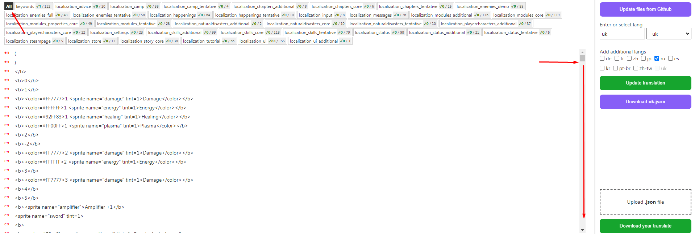
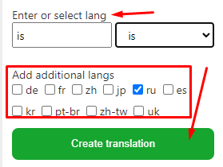
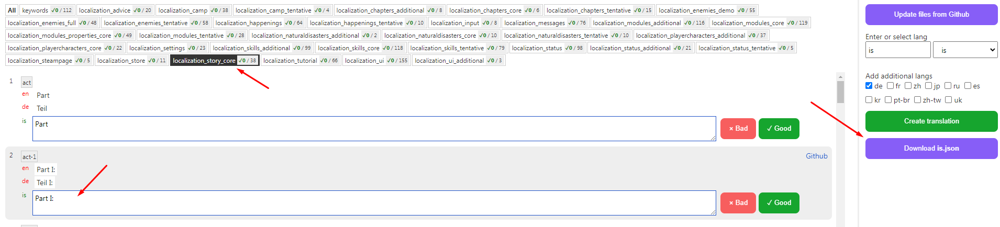
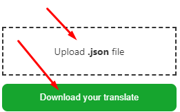

# roguevoltage-localization-editor

This is a simple web application to facilitate the translation of **Rogue Voltage** game https://store.steampowered.com/app/1494560/Rogue_Voltage/

## App

http://roguevoltage-localization-editor.imhvost.top/

---

## Instruction

1. Open the app using Chrome. Google Translate must be enabled: chrome://settings/languages
2. Get files from Github by clicking the "Fetch files from Github" button. **Attention - the Github Api limit for re-uploading files is 1 hour.**
3. You will see all the phrases. Translate the page using Google Translate - right-click and select "**Translate to**". Be sure to scroll the block down so that all phrases are translated.
   
4. Select the translation language. You can also add an additional existing language to make the phrase easier to understand.
   
   Click "**Create translation**"
5. A translation will be created that can be edited directly in the application or by downloading a .json file
   
6. Once the translation is complete: (if you translated a .json file, first upload it) download the .xml files
   

---

If there are any problems, write: imhvost@gmail.com

---

#### Dev Project Setup

```sh
npm install
```

#### Dev Compile and Hot-Reload for Development

```sh
npm run dev
```
