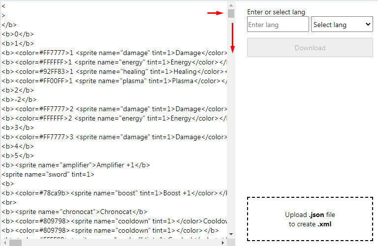
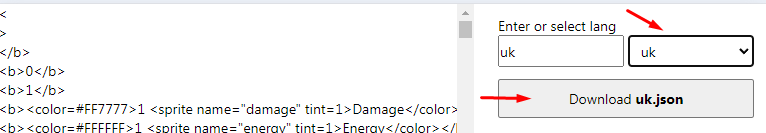
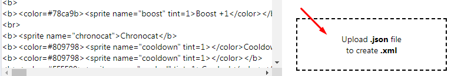

# roguevoltage-localization-app

This is a simple web application to facilitate the translation of **Rogue Voltage** game https://store.steampowered.com/app/1494560/Rogue_Voltage/

### Project Setup

```sh
npm install
```

### Compile and Hot-Reload for Development

```sh
npm run dev
```

## Instruction

1. Put the files from the repository https://github.com/roguevoltage/localization into `/public/roguevoltage-localization/`
2. Run the project with `npm run dev` and open the application with Chrome (usually `http://localhost:5173/`). Google Translate must be enabled: `chrome://settings/languages`
3. You will see all phrases. Translate the page using Google Translate - right click and select "Translate to". Be sure to scroll the block to the bottom so that all the phrases overflow. 
4. Select language, and click "Download" button 
5. A .json file will be downloaded. Proofread the text and correct the phrases of your language.
6. After proofreading, upload your .json using the "Upload" button. The .xml files will be loaded. 

## Demo

https://roguevoltage-localization-app.imhvost.top/
